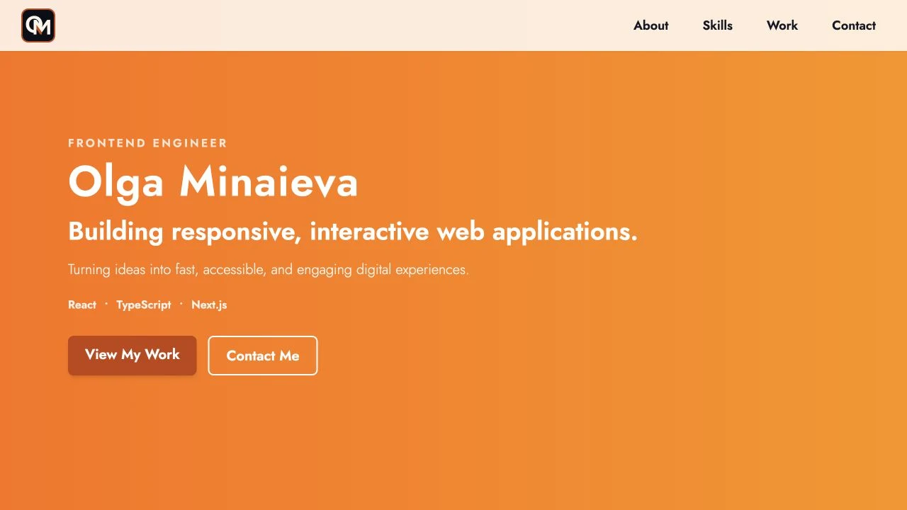

# Olga Minaieva — Frontend Engineer Portfolio

Personal portfolio for Olga Minaieva, a Toronto-based frontend engineer building responsive and accessible web applications.

**Live site:** [olga-minaieva.vercel.app](https://olga-minaieva.vercel.app/)



## Highlights

- Responsive single-page layout for mobile, tablet, and desktop
- Accessible landmarks, heading hierarchy, keyboard focus states, and skip navigation
- Active-section navigation and fixed-header scroll offsets
- Optimized WebP images with lazy loading and explicit dimensions
- Downloadable PDF résumé and direct contact links
- Open Graph, Twitter card, structured data, sitemap, and robots metadata
- Reduced-motion support for visitors who prefer fewer animations

## Built With

- React 18
- Vite 5
- Tailwind CSS 3
- React Icons
- Vitest and React Testing Library
- ESLint and Prettier

## Getting Started

```bash
git clone https://github.com/OlgaMinaievaWebDev/personal-website-new.git
cd personal-website-new
npm install
npm run dev
```

Open the local URL printed by Vite in your browser.

## Quality Checks

```bash
npm run format:check
npm run lint
npm run test
npm run build
```

GitHub Actions runs the same checks for pushes and pull requests.

## Project Structure

```text
src/components/   Page sections and navigation
src/ui/           Reusable UI components
public/           Optimized images, social metadata assets, and résumé
```

## Deployment

The site is configured for deployment on Vercel. The production build is generated with:

```bash
npm run build
```

## License

Distributed under the [MIT License](LICENSE).
